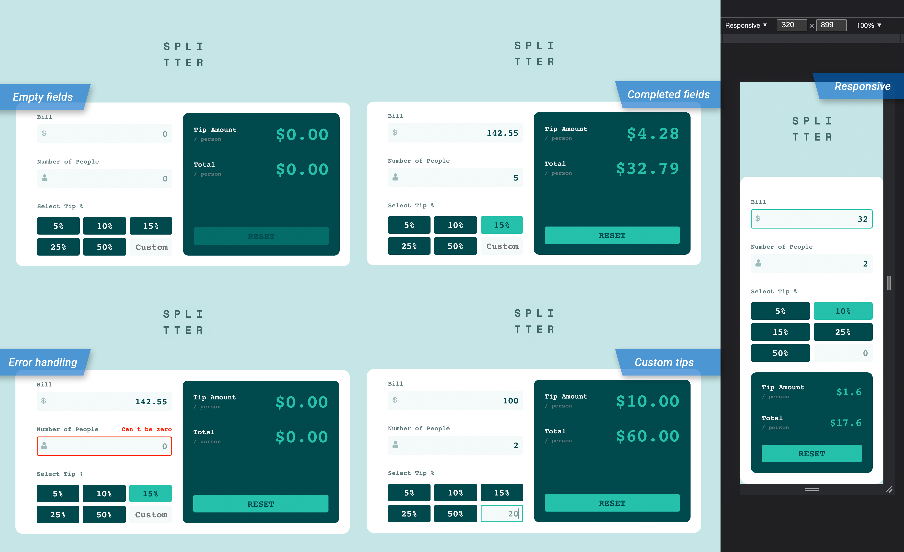

# Frontend Mentor - Tip calculator app solution

This is a solution to the [Tip calculator app challenge on Frontend Mentor](https://www.frontendmentor.io/challenges/tip-calculator-app-ugJNGbJUX). [Frontend Mentor](www.frontendmentor.io) challenges help you improve your coding skills by building realistic projects.

## Table of contents

- [Overview](#overview)
  - [The challenge](#the-challenge)
  - [Screenshot](#screenshot)
  - [Live deployment preview](#live-deployment-preview)
- [My process](#my-process)
  - [Built with](#built-with)
  - [What I learned](#what-i-learned)
  - [Continued development](#continued-development)

## Overview

### The challenge

Users should be able to:

- View the optimal layout for the app depending on their device's screen size
- See hover states for all interactive elements on the page
- Calculate the correct tip and total cost of the bill per person
- Reset fields to input new numbers
- See an error if input is zero

### Screenshots

### Live deployment preview

[tip-splitty.vercel.app](https://tip-splitty.vercel.app/)

## My process

### Built with

- React.js
- Redux, react-redux, Redux Toolkit
- SASS (scss) & CSS modules

### What I learned

I learned a bit about useCallback and useMemo hooks and how to deal with stale values from useRef (component reloads, but ref points to "former" value).
### Continued development

I strongly believe the current component structure is not ideal.
Also, I resorted to redux to help with state management, although it could have been done better with context and a better structure.